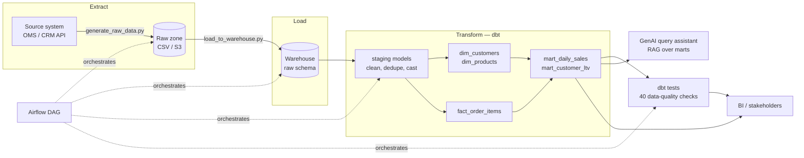

# Retail Data Pipeline & AI Insights Assistant

An end-to-end batch ELT data pipeline for e-commerce order data — raw source
ingestion, a dimensional warehouse model built with **dbt**, production-style
**Airflow** orchestration, data-quality testing, and a **retrieval-augmented
(RAG) natural-language query assistant** on top of the marts.

Built as a portfolio project to demonstrate the day-to-day toolkit of a Data
Engineer role: SQL-first transformation, orchestration, testing, and a
practical (not gimmicky) GenAI integration.

> **Status:** fully runnable locally. Every component below except the
> Airflow scheduler itself (see note in Orchestration) has been executed and
> verified — see [Verified Run Output](#verified-run-output).

---

## Architecture



**Why this stack:** the roles I'm targeting call for Snowflake/Databricks +
dbt + Airflow + Python/SQL, with GenAI/RAG increasingly listed as a
differentiator. This project uses the same SQL and orchestration patterns
those stacks use, on tooling that runs free and locally so anyone can clone
and run it in under a minute — see [Production Deployment](#production-deployment-notes)
for exactly what changes to point it at real Snowflake/Databricks/MWAA.

---

## Tech Stack

| Layer | Tool | Notes |
|---|---|---|
| Ingestion | Python, Faker, pandas | Simulates a source-system extract into a raw landing zone |
| Warehouse | DuckDB | Local, free, ANSI-SQL — a drop-in stand-in for Snowflake/Databricks SQL |
| Transformation | dbt-core + dbt-duckdb | Staging → dimensional marts, with schema tests & auto-generated docs |
| Orchestration | Apache Airflow (TaskFlow API) | Production DAG; a local `run_pipeline.py` mirrors the same task graph |
| Data quality | dbt tests | 40 tests: `unique`, `not_null`, `relationships`, `accepted_values` |
| GenAI / RAG | scikit-learn (TF-IDF retrieval) + optional Claude | Natural-language query assistant over the marts |
| Testing | pytest | 13 unit tests on ingestion logic and the query assistant |
| CI | GitHub Actions | Runs the full pipeline + tests on every push |

---

## Project Structure

```
retail-de-pipeline/
├── ingestion/
│   ├── generate_raw_data.py     # EXTRACT: synthetic but realistic raw source data
│   └── load_to_warehouse.py     # LOAD: raw CSVs -> warehouse raw schema
├── dbt_project/
│   ├── models/staging/          # cleaned, typed, de-duplicated staging views
│   ├── models/marts/            # dim_customers, dim_products, fact_order_items,
│   │                             #   mart_daily_sales, mart_customer_ltv
│   ├── dbt_project.yml
│   └── profiles.yml              # local DuckDB target (+ commented Snowflake example)
├── orchestration/
│   ├── run_pipeline.py          # locally-runnable orchestrator (what CI actually runs)
│   └── airflow_dag.py           # production Airflow 2.7+ DAG, same task graph
├── genai_assistant/
│   ├── query_library.py         # curated question -> SQL knowledge base
│   ├── build_index.py           # builds the TF-IDF retrieval index
│   └── ask_data.py              # RAG CLI: retrieve -> augment -> execute -> generate
├── tests/                        # pytest unit tests
├── .github/workflows/ci.yml
└── requirements.txt
```

---

## Data Model

Star schema, one fact grain (order line item), two conformed dimensions,
and two business-facing aggregate marts:

- **`dim_customers`** — one row per customer (region, loyalty tier, signup date)
- **`dim_products`** — one row per product (category, price, supplier)
- **`fact_order_items`** — one row per order line item (the atomic grain everything rolls up from)
- **`mart_daily_sales`** — daily revenue & units sold by region × category, cancelled orders excluded
- **`mart_customer_ltv`** — lifetime spend, order count, and recency per customer, for churn/segmentation analysis

Every mart's business logic (e.g. *what counts as revenue*) is defined
exactly once, in the mart SQL — the GenAI assistant and any BI tool read
from the same number, so "revenue" can never mean two different things in
two different places.

---

## Quickstart

```bash
git clone <this-repo>
cd retail-de-pipeline
pip install -r requirements.txt

# runs generate_raw_data -> load_to_warehouse -> dbt run -> dbt test
python orchestration/run_pipeline.py

# build the RAG index and ask a question
cd genai_assistant
python build_index.py
python ask_data.py "who are our top 5 customers by spend"
```

Explore the warehouse directly:
```bash
python -c "import duckdb; duckdb.connect('data/warehouse.duckdb').sql('select * from main_marts.mart_daily_sales limit 10').show()"
```

Or browse the auto-generated dbt docs (lineage graph, column-level descriptions):
```bash
cd dbt_project && dbt docs generate --profiles-dir . --project-dir . && dbt docs serve --profiles-dir . --project-dir .
```

---

## The GenAI / RAG Layer

`genai_assistant/ask_data.py` is a small but genuine retrieval-augmented
generation pipeline, deliberately built to run **offline with no API key**:

1. **Retrieve** — the question is embedded with TF-IDF and matched by cosine
   similarity against a curated library of question ↔ SQL pairs
   (`query_library.py`), plus live schema documents pulled straight from
   the warehouse's `information_schema` (so retrieval never drifts from
   what the marts actually contain).
2. **Augment** — slots in the retrieved SQL template (e.g. "top *N*") are
   filled from the question.
3. **Execute** — the resulting SQL runs against the warehouse.
4. **Generate** — the result is rendered into a natural-language answer.

Step 4 is a deterministic template by default; `--use-llm` swaps it for an
actual Claude call (`generate_with_llm()` in `ask_data.py`) that turns the
retrieved context + SQL result into a more natural answer — present as a
code path to show the integration pattern, without making the rest of the
project depend on an API key.

Example:
```
$ python ask_data.py "which customers are at risk of churning"
Q: which customers are at risk of churning
[retrieved: template:customers_at_risk  similarity=0.464]
A: 10 customers with no order in 90+ days (highest churn risk):
  - customer_name=Thomas White, region=East, loyalty_tier=Bronze, days_since_last_order=137
  ...
```

Asking something out of scope fails gracefully instead of hallucinating:
```
$ python ask_data.py "what is the meaning of life"
I don't have a confident answer for that yet. Things I can answer:
  Total revenue broken down by region, Total revenue broken down by product category, ...
```

---

## Orchestration

`orchestration/run_pipeline.py` and `orchestration/airflow_dag.py` define
**the same task graph** — `extract → load → dbt run → dbt test → refresh
GenAI index` — so the pipeline's logic can be fully verified locally before
it's ever scheduled:

- `run_pipeline.py` is what actually executes in this repo (and in CI):
  plain Python, with per-task logging, timing, and retry/backoff.
- `airflow_dag.py` is the Airflow 2.7+ TaskFlow-API deployment artifact —
  same steps, but with declarative retries, SLAs, alerting, and a daily
  cron schedule, ready to drop into MWAA / Cloud Composer / self-hosted
  Airflow. *(Not executed in this environment — no Airflow scheduler here —
  but the DAG file is syntax-validated and reviewed against the exact same
  task functions that `run_pipeline.py` runs.)*

---

## Data Quality

40 automated dbt tests run on every pipeline execution:

- `unique` / `not_null` on every primary key
- `relationships` (referential integrity) between facts and dimensions
- `accepted_values` on categorical fields (order status, loyalty tier)

A failed test fails the pipeline run — the same gate a production
`dbt build` would enforce before a mart is considered safe to query.

---

## Production Deployment Notes

This project intentionally uses free, local tooling (DuckDB, TF-IDF) so it
runs anywhere with zero setup cost — but every piece maps directly onto the
cloud stack it's meant to demonstrate:

| Local (this repo) | Production equivalent | What changes |
|---|---|---|
| DuckDB file | Snowflake / Databricks SQL | `ingestion/load_to_warehouse.py`'s `get_connection()` — every model's SQL is already ANSI-compatible |
| `run_pipeline.py` | Airflow on MWAA / Cloud Composer | Deploy `airflow_dag.py`; no pipeline logic changes |
| Synthetic CSVs | Real OMS API / CDC stream | Replace `generate_raw_data.py`'s extract step; schema stays the same |
| TF-IDF retrieval | Managed vector DB (Pinecone/pgvector) + embedding API | Swap `build_index.py`'s vectorizer; `ask_data.py`'s retrieve/augment/execute contract is unchanged |
| Deterministic answer templates | Claude/GPT generation | Already wired via `ask_data.py --use-llm` |
| Raw CSVs on local disk | S3 / ADLS raw zone | `RAW_DIR` path becomes a bucket path |

A typical production home for this exact pipeline: **S3 (raw) → Snowflake
or Databricks (warehouse) → dbt Cloud or self-hosted dbt-core → Airflow
(MWAA) for orchestration → a vector DB + Claude for the assistant.**

---

## Verified Run Output

```
$ python orchestration/run_pipeline.py
======================================================================
RETAIL DATA PIPELINE — starting run
======================================================================
[generate_raw_data] SUCCESS in 0.80s
[load_to_warehouse] SUCCESS in 0.32s
[dbt_run] SUCCESS in 3.43s
[dbt_test] SUCCESS in 3.68s
======================================================================
PIPELINE COMPLETE
  generate_raw_data        0.80s
  load_to_warehouse        0.32s
  dbt_run                  3.43s
  dbt_test                 3.68s
  TOTAL                    8.23s
======================================================================
```

- Raw data generated: 502 customers · 120 products · 8,000 orders · 24,097 order line items
- dbt: **9 models built, 40 tests passed, 0 errors**
- pytest: **13/13 unit tests passed**
- GenAI assistant: indexed 9 query templates + 9 live schema documents; verified against 5 sample questions including one graceful out-of-scope refusal

---

## Resume-Ready Description

**Retail Data Pipeline & AI Insights Assistant** — *Personal project*

Built and deployed an end-to-end ELT pipeline (Python, dbt, Airflow, SQL)
processing 8,000+ orders into a tested dimensional warehouse, plus a
retrieval-augmented natural-language query assistant over the resulting
marts.

- Designed and built a dimensional data warehouse (2 dimensions, 1 fact,
  2 aggregate marts) with dbt-core, enforcing data quality with 40
  automated tests (uniqueness, referential integrity, accepted values)
  gating every pipeline run
- Engineered a Python ELT pipeline (extract → load → transform) with
  retry/backoff and structured logging, and authored a companion
  production Airflow DAG (TaskFlow API) for daily scheduled orchestration
- Built a retrieval-augmented generation (RAG) assistant enabling
  natural-language querying of warehouse data — TF-IDF retrieval over a
  curated query library and live schema metadata, with an LLM (Claude)
  generation path for production use
- Wrote unit tests (pytest) and a GitHub Actions CI pipeline that runs the
  full ELT flow and test suite on every commit
- Designed the stack to be warehouse-agnostic: every model is ANSI-SQL,
  swappable from local DuckDB to Snowflake/Databricks via a single
  connection-layer change, with no changes to transformation logic
